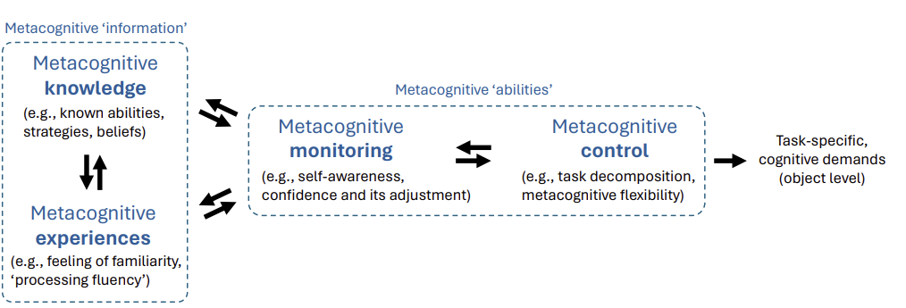

<!-- _class: paper-title -->

# The Metacognitive Demands and Opportunities of Generative AI
## 生成式 AI 带来的"元认知"挑战

**作者:** Lev Tankelevitch (Microsoft Research), et al.  
**发表:** CHI 2024  
**链接:** [Paper](https://dl.acm.org/doi/10.1145/3613904.3642902)

---
<!-- _class: overview -->

# 论文概览

> **一句话总结:** 提出一个理论框架，认为使用 GenAI 就像"当经理"，用户不再是执行者，而是监督者，这带来了巨大的**元认知负荷 (Metacognitive Load)**。

**研究问题:** 
- 为什么 GenAI 有时候反而让人觉得"累"？
- 除了具体的 Prompt 技巧，用户在**认知层面**面临什么挑战？

**关键词:** `Metacognition` `Human-AI Interaction` `Cognitive Load` `Managerial Role`

---
<!-- _class: method -->

# 理论基础: 元认知框架

- **Metacognitive Knowledge/Experiences:** 用户对自己能力、策略的认知。
- **Monitoring:** 自我评估（"我理解了吗？AI 做得对吗？"）
- **Control:** 调整策略（任务分解、灵活切换方法）

---
<!-- _class: contribution -->

# 核心观点: 用户即"经理"

使用 GenAI 时，用户角色的转变：
- **Before:** 自己动手写代码/写文章 (Doing)。
- **Now:** 指挥 AI 去做，并检查结果 (Managing)。

这要求极高的 **元认知能力 (Metacognition)**：
1.  **Monitoring (监控):** "AI 做的对不对？" "我是不是表达清楚了？"
2.  **Control (控制):** "我该换个说法吗？" "这里我需要人工介入吗？"

---
<!-- _class: method -->

# 四大元认知需求 (Demands)

1.  **Prompting (指令):** 
    - 需要将模糊的目标**分解**为 AI 能理解的具体任务。
    - 需要清楚自己的意图 (Self-awareness)。

2.  **Evaluating (评估):** 
    - 面对 AI 产生的看似完美实则胡编乱造的内容，用户需要**校准自信心**。
    - "这是事实，还是幻觉？"

3.  **Workflow Strategy (工作流策略):** 
    - 决定**何时**使用 AI，何时不用。
    - "这个问题值得我花 5 分钟写 Prompt 吗？还是我自己 2 分钟写完？"

4.  **Learning (学习):** 
    - 随着模型更新，原本有效的策略可能失效，需要持续调整心智模型。

---
<!-- _class: findings -->

# 设计机会 (Opportunities)

如何降低这种元认知负荷？

1.  **Explainability (可解释性):** 
    - 系统应主动展示"为什么我这么生成"，帮助用户建立信任。
    - *Example:* 显示引用的来源（如 Bing Chat）。

2.  **Customizability (可定制性):** 
    - 允许用户调整系统的"性格"或"能力边界"，使其符合用户的预期。

3.  **Metacognitive Support (元认知支持):** 
    - 系统可以反问用户："你确定要这么做吗？这可能会导致..."
    - 帮助用户进行**任务分解**。

---

# Thinking

**优点:**
-  **理论深度:** 用心理学中的"元认知"理论很好地解释了当前 GenAI 用户的痛点。
-  **框架清晰:** 将零散的 usability 问题（如幻觉、prompt 难写）统一到了一个框架下。

**关联:**
- 与 *Why Johnny Can't Prompt* 互补：那篇讲"现象"，这篇讲背后的"认知机理"。
- 与 *Metacognitive Prompting* 互补：那篇是让 AI 有元认知，这篇是讲 Humans 需要元认知。

**启发:**
-  未来的 AI 交互设计，重点不是"让 AI 更聪明"，而是**"降低用户的管理成本"**。
-  Copilot 的设计应该像一个"主动汇报进度的下属"，而不是"沉默的黑箱"。

